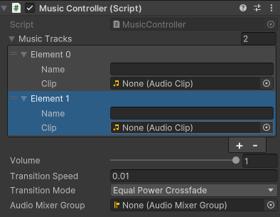

# Music Flow Controller 🎵

**Simple Music Controller for Unity providing smooth audio transitions without gain loss and desync issues**

[](https://unity.com/)
[](https://github.com/TheStami/Unity-MusicFlowController)
[](LICENSE)

## 📖 Description

*Unity Music Flow Controller* is an simple music control system for Unity that provides smooth transitions between musical tracks without unwanted volume drop. The default "Equal Power Crossfade" mode maintain consistent volume during track changes.

## 🚀 Installation

### Method 1: Package Manager (Unity 2019.3+)

1. Open **Window > Package Manager** in Unity
2. Click **+** and select **Add package from git URL**
3. Paste: `https://github.com/TheStami/Unity-MusicFlowController.git`

<!-- ### Method 2: Import Asset
1. Download the latest version from [Releases](https://github.com/TheStami/Unity-MusicFlowController/releases)
2. Extract and import into your Unity project -->

## 📚 Quick Start

### 1. Basic Setup

Add `MusicController` component to object.


You can add as many music tracks as you want. Name is optional. Add AutioClip to it.

Volume is is the target volume after playing the song, you can control maximum volume here or add `Audio Mixer Group`.

### 2. Playback Control

When you got component (`GetComponent<MusicController>()`), you can control tracks by index or by giving `MusicTrack` list.

```csharp
// Play single track
musicController.PlayTrack(0); // Play first track

// Play with stop others
musicController.PlayTrack(1, true); // Play second, stop all others

// Stop all tracks
musicController.StopAllTracks();

// Control multiple tracks simultaneously
musicController.PlayTracks(
    new int[] { 0, 2 },    // Tracks to start
    new int[] { 1 }        // Tracks to stop
);

List<MusicTrack> allTracks = musicController.MusicTracks;
musicController.PlayTracks(
    allTracks.Where(x => x.name == "happy").ToArray();
    allTracks.Where(x => x.name == "sad").ToArray();
);
```

## ⚙️ Configuration

### MusicController Parameters

| Parameter         | Type                | Description          | Default Value       |
| ----------------- | ------------------- | -------------------- | ------------------- |
| `musicTracks`     | List<MusicTrack>    | List of music tracks | -                   |
| `volume`          | float (0-1)         | Destination volume   | 1.0                 |
| `transitionSpeed` | float               | Transition speed     | 2.0                 |
| `transitionMode`  | MusicTransitionType | Transition type      | EqualPowerCrossfade |
| `audioMixerGroup` | AudioMixerGroup     | Audio Mixer Group    | -                   |

### Transition Types

#### 1. **Equal Power Crossfade** (Default)

- **Benefits**: Maintains consistent volume during transitions
- **Algorithm**: Uses sine/cosine functions for smooth transitions

#### 2. **Linear**

- **Benefits**: Simple, predictable transitions, with audible transitions between tracks 
- **Algorithm**: Linear volume interpolation

#### 3. **Lerp**

- **Benefits**: Smooth transitions with acceleration
- **Algorithm**: Lerp interpolation with curve

<!-- ## 🎯 Usage Examples

### Example 1: Game Menu System

```csharp
public class MenuMusicSystem : MonoBehaviour
{
    [SerializeField] private MusicController musicController;
    [SerializeField] private AudioClip mainMenuMusic;
    [SerializeField] private AudioClip settingsMusic;

    void Start()
    {
        // Track configuration
        MusicTrack[] tracks = new MusicTrack[]
        {
            new MusicTrack { name = "Main Menu", clip = mainMenuMusic },
            new MusicTrack { name = "Settings", clip = settingsMusic }
        };

        musicController.Initialize(tracks);
        musicController.transitionSpeed = 0.02f; // Slower transitions
        musicController.transitionMode = MusicTransitionType.EqualPowerCrossfade;
    }

    public void SwitchToSettingsMusic()
    {
        musicController.PlayTrack(1, true);
    }

    public void ReturnToMainMenu()
    {
        musicController.PlayTrack(0, true);
    }
}
```

### Example 2: Dynamic Game Music

```csharp
public class GameMusicManager : MonoBehaviour
{
    [SerializeField] private MusicController musicController;

    [Header("Music Tracks")]
    [SerializeField] private AudioClip explorationMusic;
    [SerializeField] private AudioClip combatMusic;
    [SerializeField] private AudioClip victoryMusic;

    void Start()
    {
        SetupMusicTracks();
    }

    void SetupMusicTracks()
    {
        MusicTrack[] tracks = new MusicTrack[]
        {
            new MusicTrack { name = "Exploration", clip = explorationMusic },
            new MusicTrack { name = "Combat", clip = combatMusic },
            new MusicTrack { name = "Victory", clip = victoryMusic }
        };

        musicController.Initialize(tracks);
        musicController.transitionSpeed = 0.015f;
        musicController.transitionMode = MusicTransitionType.EqualPowerCrossfade;
    }

    public void StartCombat()
    {
        musicController.PlayTrack(1, true);
    }

    public void EndCombat()
    {
        musicController.PlayTrack(0, true);
    }

    public void PlayVictoryMusic()
    {
        musicController.PlayTrack(2, true);
    }
}
```

### Example 3: Volume Control

```csharp
public class VolumeController : MonoBehaviour
{
    [SerializeField] private MusicController musicController;
    [SerializeField] private Slider volumeSlider;

    void Start()
    {
        volumeSlider.value = musicController.volume;
        volumeSlider.onValueChanged.AddListener(OnVolumeChanged);
    }

    void OnVolumeChanged(float newVolume)
    {
        musicController.volume = newVolume;
    }
}
``` -->

<!-- ## 🔧 Audio Mixer Integration

```csharp
[SerializeField] private AudioMixerGroup musicGroup;
[SerializeField] private AudioMixerGroup sfxGroup;

void Start()
{
    // Initialize with Audio Mixer Group
    musicController.Initialize();

    // Set group for all tracks
    foreach (var track in musicController.MusicTracks)
    {
        track.Source.outputAudioMixerGroup = musicGroup;
    }
}
``` -->

<!-- ## 📱 System Requirements

- **Unity**: 2022.3 or newer
- **Platforms**: All platforms supported by Unity
- **Dependencies**: No external dependencies -->

## 📄 License

This project is licensed under the MIT License. See the [LICENSE](LICENSE) file for details.
